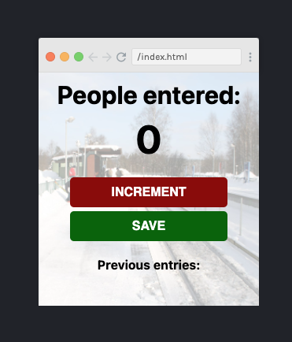

# DOM Manipulation & Timing

For this project I went through a Scrimba course for beginners in Javascript, that I knew touched on DOM.
	[Learn JavaScript for free](https://scrimba.com/learn/learnjavascript)
The course takes you through step by step how to build a simple people counter that stores the previous entries.
I used that base, styled it and added some interactivity with DOM manipulation.

## What I did:

- build the app using JavaScript with the help of Scrimba
    This is what it looked like
    
- styled it with CSS and added styles with DOM
- hover state on buttons with JS control
- setInterval to display a clock
- setTimeout to display a pop up message in the browser

I also read about the main consepts to get the main lingo in DOM

## The DOM lingo:
### What is DOM?
The Document Object Model, or DOM is a representation of a document (like an HTML page) as a group 
of objects. While it is often used to represent HTML documents, and most web browsers use JavaScript 
interfaces to the DOM, it is language agnostic as a model. The DOM is tree-like and heirarchical, meaning 
that there is a single top-level object, and other objects descend from it in a branching structure. 
With the HTML DOM, JavaScript can access and change all the elements of an HTML document. The HTML DOM is 
a standard for how to get, change, add, or delete HTML elements.

### Why is it only available in browsers?
The DOM is an interface between scripting languages and a web page’s structure. The browser 
creates a Document Object Model or DOM for each of the webpage it renders. The DOM allows 
scripting languages to access and modify a web page. With the help of DOM, JavaScript gets 
the ability to create dynamic HTML.

### What are event listeners?
When you refresh your email inbox, double tap on a post, or scroll through a newsfeed — something cool 
happens in your browser. These actions are known as events! Events on the web are user interactions and 
browser manipulations that you can program to trigger functionality. Some other examples of events are:

- A mouse clicking on a button
- Webpage files loading in the browser
- A user swiping right on an image

When a user does any of the above actions, they’re causing the event to be fired or be triggered. As in, 
“a click event fired when the button was clicked”. Being able to respond to these events makes your website 
interactive and therefore dynamic.

After a specific event fires on a specific element in the  DOM, an event handler function can be created to run as a response.
Let’s compare the firing of events to something more familiar: a dog trained to eat when they hear the sound of a bell! 
As you can see in the diagram, the ringing of the bell is analogous to a JavaScript event firing. The dog is trained to anticipate 
the ringing of the bell and this action is analogous to creating an event listener. After the dog hears the bell, it’ll come over 
and eat its food! This response is like an event handler function that executes code which, in a website, could change an element’s 
color, text, and much more!”
Most events in the browser take place without being noticed — the events are undetected because there is no event handler 
associated with the event to execute an action. Event handlers are crucial for creating interactive websites with JavaScript.

### What are timing functions?

There are methods in Javascript that allow execution of code at specified time intervals. For example if you would like the colour 
og the background to change every 60 second or it you woudl like a pop up window to appear 20 sec after the homepage is opened. 
The two most common once used are setTimeout and setInterval.